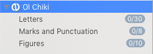

# Ol Chiki

Files for Ol Chiki support in the Glyphs.app font editor

## Installation

1. Move the the files *GlyphData.xml* and *Groups.plist,* as well as the folder *Icons* to `~/Library/Application Support/Glyphs/Info`.
2. Restart Glyphs.app

You should now see an Ol Chiki entry in the Font view (Cmd-Opt-1) sidebar under *Languages:*

# License

Copyright 2018 Rainer Erich Scheichelbauer (@mekkablue).

Licensed under the Apache License, Version 2.0 (the "License");
you may not use the software provided here except in compliance with the License.
You may obtain a copy of the License at

http://www.apache.org/licenses/LICENSE-2.0

See the License file included in this repository for further details.
